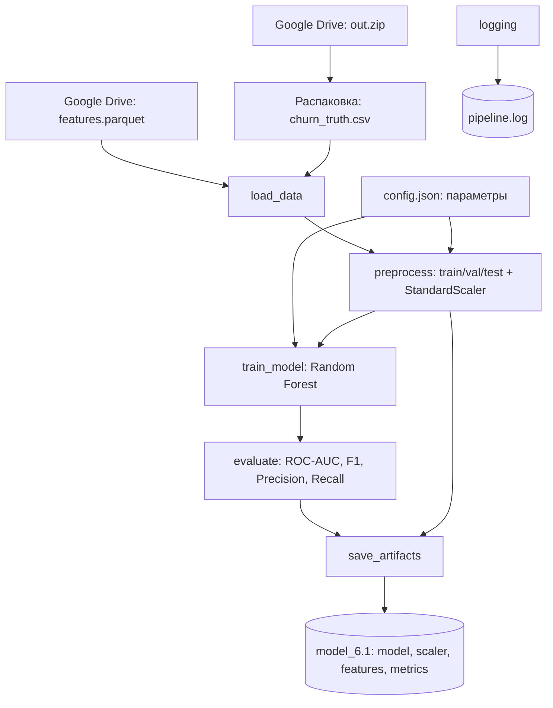

# Архитектура

```mermaid
flowchart TD
    A[Google Drive: out.zip] --> B[Распаковка: churn_truth.csv]
    C[Google Drive: features.parquet] --> D[load_data]
    B --> D
    D --> E[preprocess: train/val/test + StandardScaler]
    F[config.json: параметры] --> E
    F --> G[train_model: Random Forest]
    E --> G
    G --> H[evaluate: ROC-AUC, F1, Precision, Recall]
    H --> I[save_artifacts]
    I --> J[(model_6.1: model, scaler, features, metrics)]
    E --> I
    K[logging] --> L[(pipeline.log)]
```

`run_pipeline()` последовательно вызывает загрузку, предобработку,
обучение, оценку и сохранение; параметры берутся из `config.json`.
